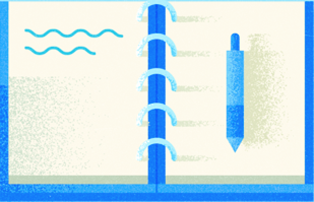

import { Section, Button, ImageContainer, TwoColumnsGrid, Chips, Buttons } from "@robinguan/gatsby-mdx-mui-theme"

<Section background={"#D0CDE1"}>
<Chips chips={['ele1', 'ele2', 'ele3', 'ele4', 'ele5']} />

<ImageContainer width={'50%'} border={1} borderColor={'secondary.light'}>

</ImageContainer>
<h4>Project Name</h4>

A web application to help sdevelopers and programmers build beautifully designed portfolios in minutes 

<Button color={'primary'} href={'https://www.google.com/'}>Hello</Button>

<Buttons buttons={[{label:'frist button', href:'https://www.google.com/', color: 'primary'}, {label:'second button', href:'https://www.google.com/', color: 'primary'}]} />

</Section>

<Section background={"#fff"}>
<ImageContainer width={'50%'}>

</ImageContainer>
<h4>Project Name</h4>

A web application to help sdevelopers and programmers build beautifully designed portfolios in minutes 

<TwoColumnsGrid right={ <ImageContainer width={'80%'}>

</ImageContainer> } left={<Button color={'primary'} href={'https://www.google.com/'}>Hello</Button>} />
</Section>

<Section background={"#D0CDE1"}>
<ImageContainer width={'50%'} >

</ImageContainer>
<h4>Project Name</h4>

A web application to help sdevelopers and programmers build beautifully designed portfolios in minutes 

<Button color={'primary'} href={'https://www.google.com/'}>Hello</Button>
</Section>